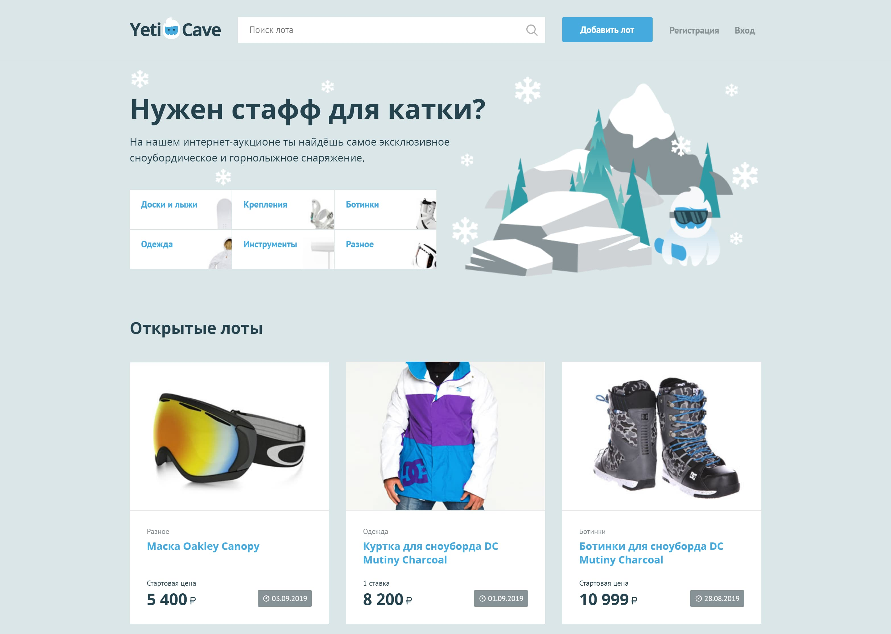

# Личный проект «YetiCave»

* Студент: [Вячеслав Акулов](https://up.htmlacademy.ru/php/8/user/909803).
* Наставник: [Алексей Стулов](https://up.htmlacademy.ru/php/8/user/25231).

---

---

Репозиторий создан для обучения на интенсивном онлайн‑курсе «[Профессиональный PHP, уровень 1](https://htmlacademy.ru/intensive/php)» от [HTML Academy](https://htmlacademy.ru).
